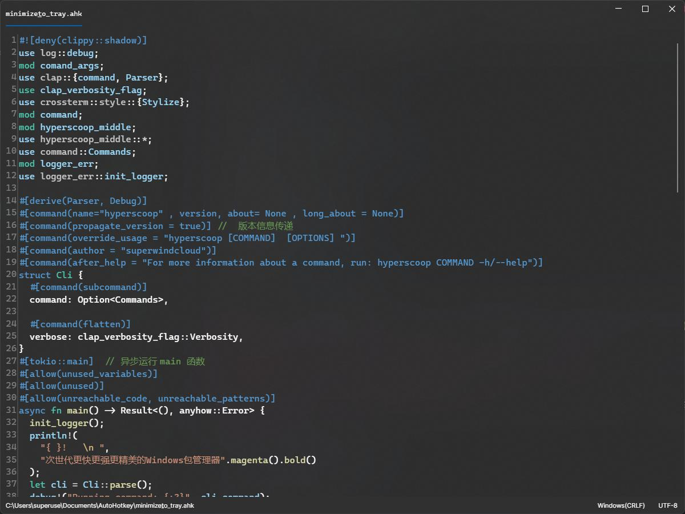
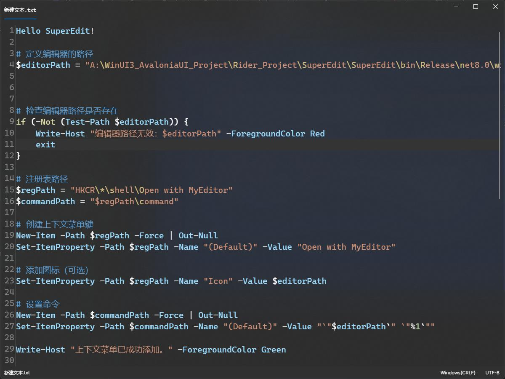
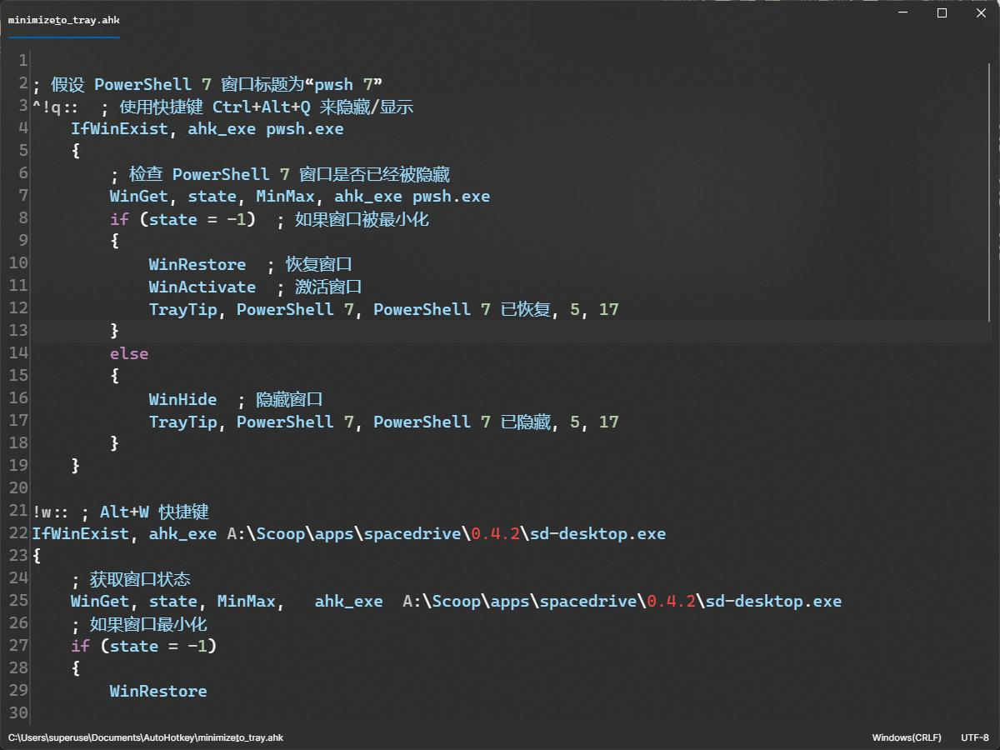

# Avalonia_Editor

### 介绍
##  基于Avalonia的精美亚克力文本编辑器

 
## 快速开始 

- [下载release体验](https://github.com/Super1Windcloud/Awesome_Editor/releases/download/7.7.7/SuperEdit.exe)
-  通过scoop 安装
```powershell
scoop  bucket add hy https://gitee.com/SuperWindcloud/hyperscoop_bucket 
 scoop install -u   hy/superedit 
```

> ####   Avalonia 动态渲染太难搞了,只花了两天时间写,但是我还有更重要的项目任务,并且C#不值得浪费我太多时间,所以只能当做一个临时修改文件内容的编辑器,无法和Notepads这样的相提并论


## 功能
- 打开文件
- 保存文件
- 打开文件所在目录
- 复制、粘贴、剪切,全选,撤销,重做,查找,替换
- 字体、字号、颜色
- 自动换行
- 自动补全
- 语法高亮
- 行号
- 自动保存
- 主题切换
- 多语言支持
## 支持将应用添加到资源管理器上下文菜单
> - [方式一] (https://www.cnblogs.com/clis/p/15132215.html)
> - 方式二   
---

---

---

---

---


---
 
