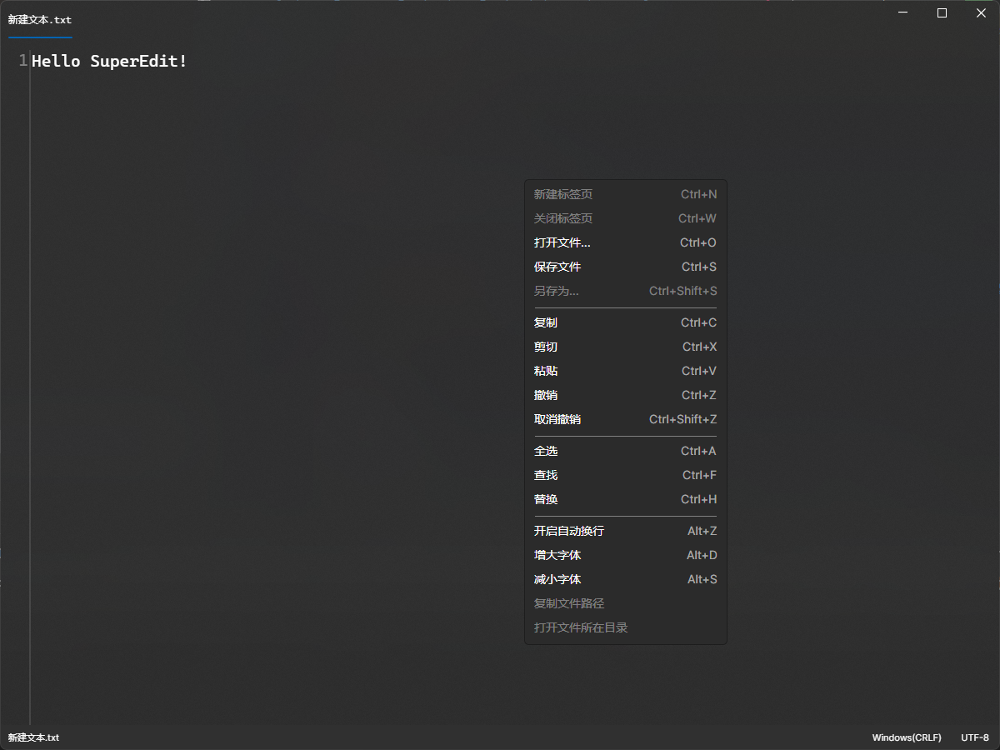

# Avalonia_Editor

### 介绍
##  基于Avalonia的精美亚克力文本编辑器

 
## [下载release体验](https://gitee.com/SuperWindcloud/avalonia_-editor/releases/download/1.1.1/SuperEdit.exe)

> ###  Avalonia 动态渲染太难搞了,只花了两天时间写,但是我还有更重要的项目任务,并且C#不值得浪费我太多时间,所以只能当做一个临时修改文件内容的编辑器,无法和Notepads这样的相提并论

## 功能
- 打开文件
- 保存文件
- 打开文件所在目录
- 复制、粘贴、剪切,全选,撤销,重做,查找,替换
- 字体、字号、颜色
- 自动换行
- 自动补全
- 语法高亮
- 行号
- 自动保存
- 主题切换
- 多语言支持
 
---

---

---

---

---
